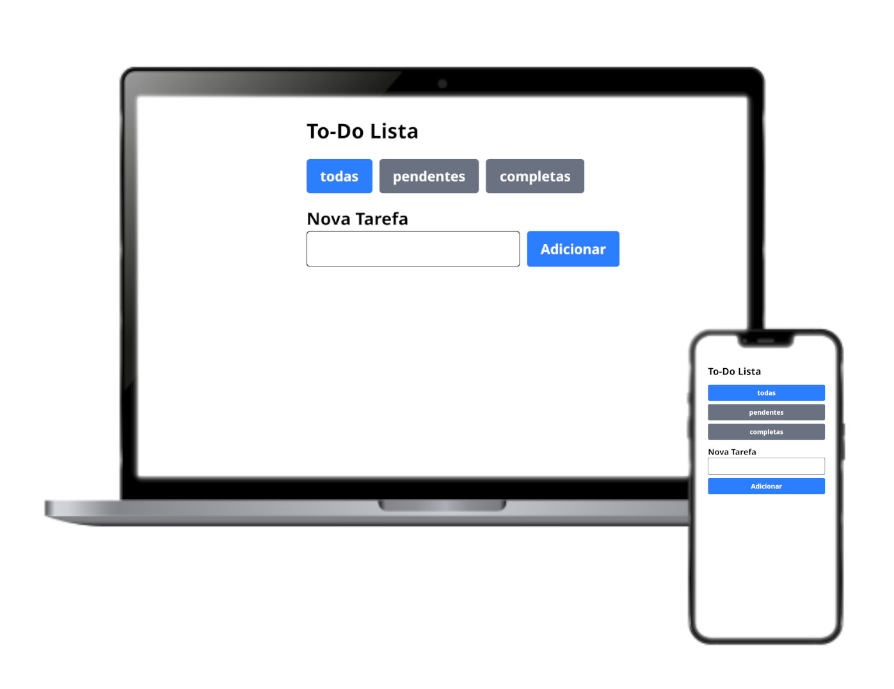

# 📝 To-Do List

Um projeto simples de **Lista de Tarefas** desenvolvido em **React + Vite** com **TailwindCSS**, utilizando **LocalStorage** para persistência de dados.

## 🚀 Funcionalidades

- ➕ Adicionar novas tarefas  
- ✅ Marcar tarefas como concluídas  
- ❌ Remover tarefas  
- 🔄 Persistência no navegador via LocalStorage  
- ⏳ Exibir tarefas **pendentes, concluídas ou todas** (filtro)  
- 🕹 Interface simples, responsiva e moderna com TailwindCSS  

---

## 🖼 Preview

  

---

## 🛠 Tecnologias Utilizadas

- [React](https://react.dev/)  
- [Vite](https://vitejs.dev/)  
- [TailwindCSS](https://tailwindcss.com/)  
- [LocalStorage API](https://developer.mozilla.org/en-US/docs/Web/API/Window/localStorage)  

---

## 📂 Estrutura de Pastas

src/
├─ assets/ # imagens e ícones
├─ components/ # componentes reutilizáveis (Button, Input, TaskCard)
├─ context/ # contexto global (TodoContext)
├─ hooks/ # hook customizado (useLocalStorage)
├─ pages/ # páginas da aplicação (Home)
├─ utils/ # helpers (truncateText, filtros, etc.)
├─ App.jsx # componente raiz
├─ main.jsx # ponto de entrada
└─ index.css # estilos globais

---

O app estará disponível em:
👉 https://eduardolima01.github.io/todo-app/

---

🌟 Melhorias Futuras

- Marcar como feito
- Deletar tarefa

